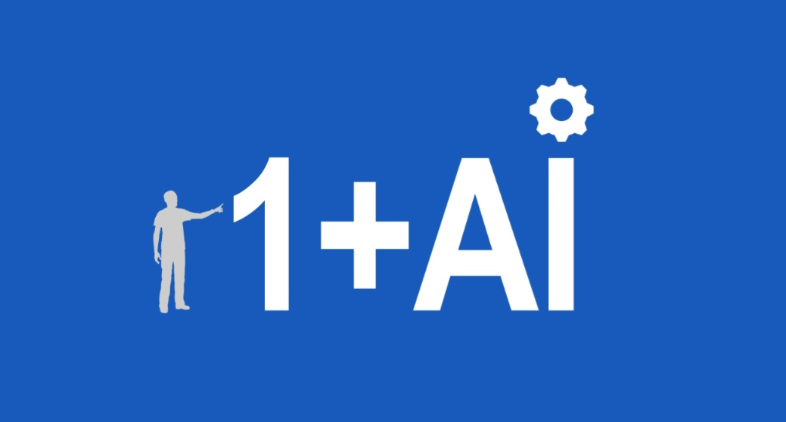
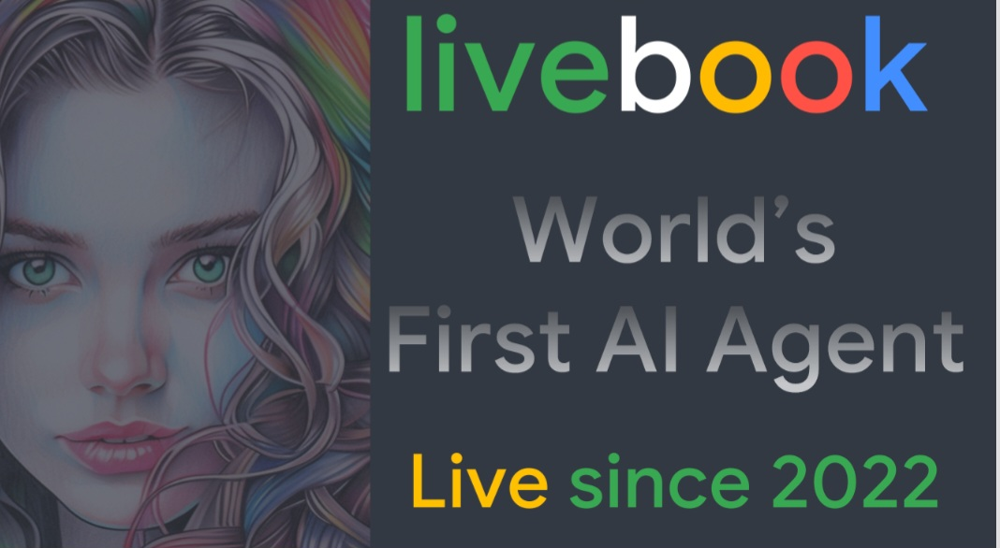

1+AI Humans working with AI 

This is a list of projects created by humans with AI. 

## 1+AI Projects

These projects were created by a single human + AI.

- [AGENTOMAT](https://agentomat.com) - AI Agents as a Service (AaaS) - the easiest platform for AI agents
- [AI Coaching](https://aicoaching.us) - AI Coaching is a platform for coaching with AI by US Olympic and Paralympic Committee 
- [Livebook](https://livebookai.com) - First in the world publicly available AI Agent, running since 2022.

## AGENTOMAT

New AI platform to accelerate your AI solutions. If you are thinking of starting an AI solution for your business, consider our blueprint solutions! A blueprint is a prebuilt solution that can be customized by our consulting team or in partnership with your business to the needs of your business. 

[Agents as a Service for Business (AaaS)](https://agentomat.com)

## AI Coaching

AI Coaching is our joint project with the US Olympic and Paralympic Committee that provides AI Assistants available 24/7 for coaches and athletes to help with everyday training, coaching practice, personal training and more. 

## Livebook

Livebook AI is the first publicly available AI Agent, that has been running continuously since 2022. It was the first agent with AI Kiosk, installed at the Computer History Museum in Mountain View, California, entertaining visitors since 2022. It creates stories and illustrations in multiple categories.

